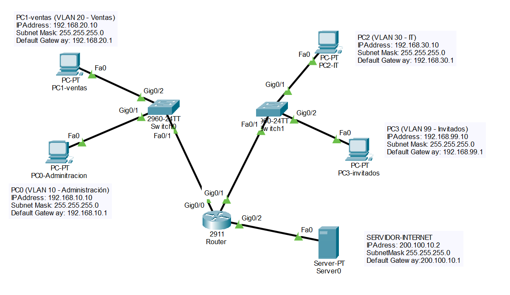
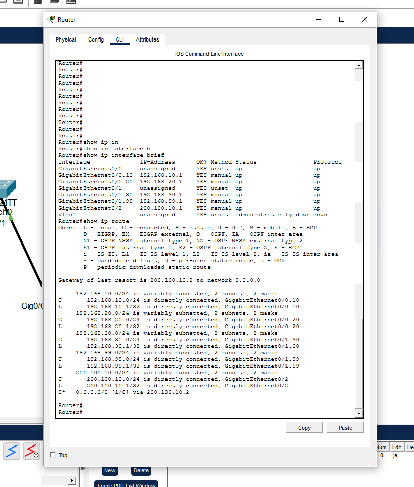
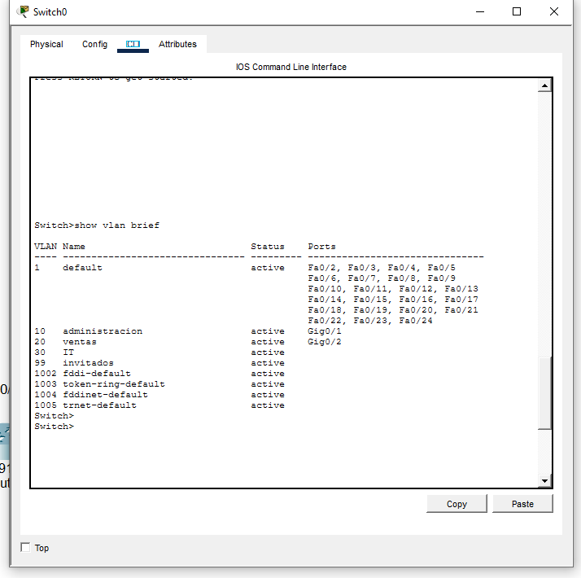
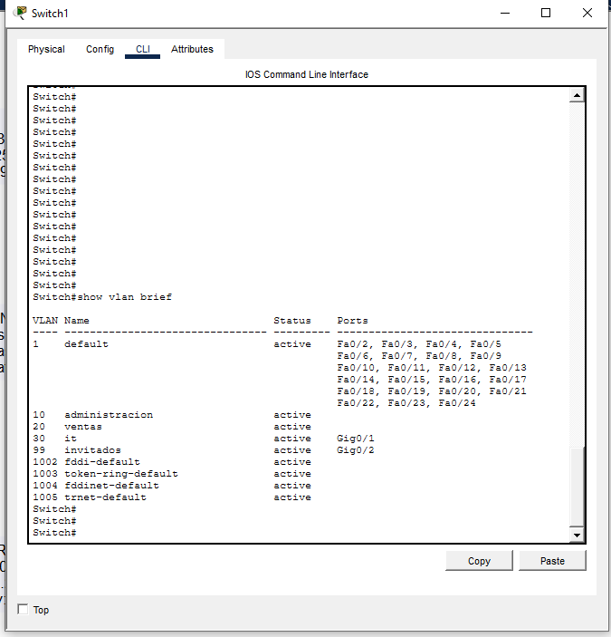
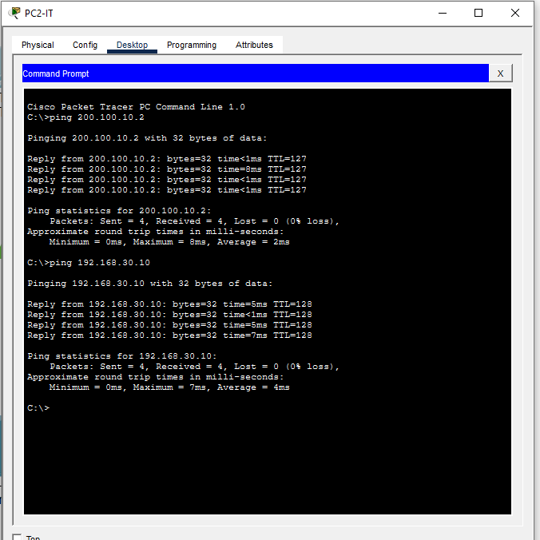
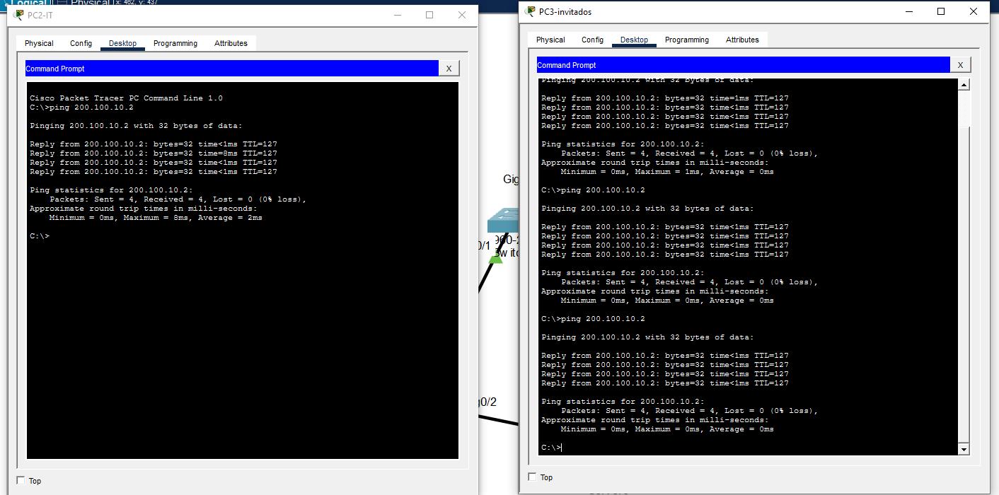
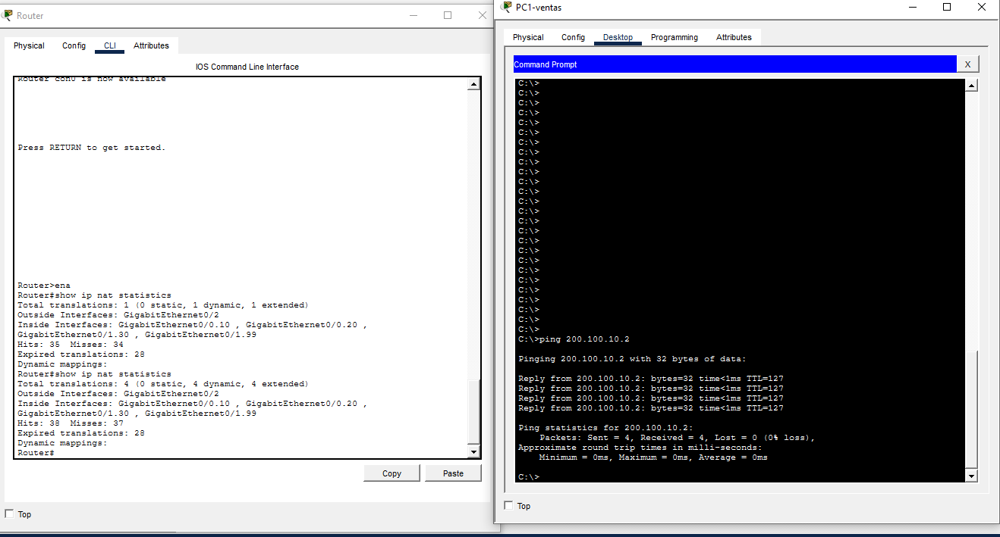
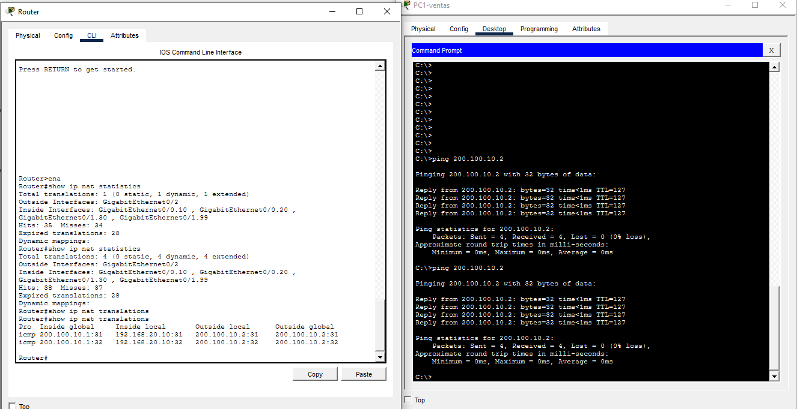
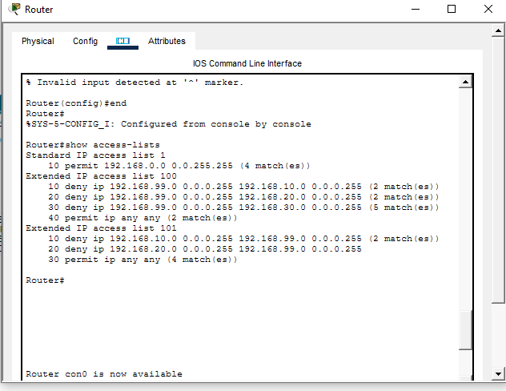

# Red LAN con VLANs, Inter-VLAN Routing, NAT y ACLs

## 📌 Descripción

Simulación de una red LAN empresarial en Cisco Packet Tracer, segmentada en 4 VLANs departamentales, con enrutamiento entre ellas (router-on-a-stick), salida a "internet" mediante NAT overload (PAT), y políticas de seguridad aplicadas con ACLs para restringir el acceso entre departamentos. Proyecto basado en conocimientos de mi certificación Cisco (CCNA), construido de forma incremental en dos fases.

## 🎯 Objetivo

Simular la red interna de una empresa con 4 departamentos (Administración, Ventas, IT e Invitados), aislados lógicamente mediante VLANs pero con capacidad de comunicarse entre sí, con salida controlada a internet a través de una única IP pública, y con políticas de seguridad que restrinjan el acceso de la red de Invitados hacia los departamentos internos.

# 🌐 Fase 1: VLANs, Inter-VLAN Routing y NAT

## 🖧 Topología de red



| Dispositivo | VLAN | IP | Gateway |
|---|---|---|---|
| PC0-Administracion | 10 | 192.168.10.10 | 192.168.10.1 |
| PC1-ventas | 20 | 192.168.20.10 | 192.168.20.1 |
| PC2-IT | 30 | 192.168.30.10 | 192.168.30.1 |
| PC3-invitados | 99 | 192.168.99.10 | 192.168.99.1 |
| Server0 (Internet simulado) | — | 200.100.10.2 | 200.100.10.1 |

**Diseño físico:** Router Cisco 2911 con 3 interfaces GigabitEthernet independientes:

| Interfaz del router | Conecta a | Función |
|---|---|---|
| GigabitEthernet0/0 | Switch0 (trunk) | Subinterfaces .10 y .20 |
| GigabitEthernet0/1 | Switch1 (trunk) | Subinterfaces .30 y .99 |
| GigabitEthernet0/2 | Server0 | Salida a internet (NAT outside) |

## 🛠️ Tecnologías y herramientas

- Cisco Packet Tracer
- Protocolo 802.1Q (trunking)
- NAT overload (PAT)
- IOS de Cisco (comandos CLI)

## ⚙️ Configuración paso a paso

### 1. Crear las VLANs

En Switch0:
```
Switch(config)# vlan 10
Switch(config-vlan)# name administracion
Switch(config)# vlan 20
Switch(config-vlan)# name ventas
```

En Switch1:
```
Switch(config)# vlan 30
Switch(config-vlan)# name it
Switch(config)# vlan 99
Switch(config-vlan)# name invitados
```

### 2. Asignar puertos de acceso

En Switch0:
```
Switch(config)# interface gigabitEthernet 0/1
Switch(config-if)# switchport mode access
Switch(config-if)# switchport access vlan 10

Switch(config)# interface gigabitEthernet 0/2
Switch(config-if)# switchport mode access
Switch(config-if)# switchport access vlan 20
```

En Switch1:
```
Switch(config)# interface gigabitEthernet 0/1
Switch(config-if)# switchport mode access
Switch(config-if)# switchport access vlan 30

Switch(config)# interface gigabitEthernet 0/2
Switch(config-if)# switchport mode access
Switch(config-if)# switchport access vlan 99
```

### 3. Configurar los enlaces troncales

En ambos switches, puerto Fa0/1 hacia el router:
```
Switch(config)# interface fastEthernet 0/1
Switch(config-if)# switchport mode trunk
```

### 4. Configurar el router-on-a-stick (subinterfaces)

En **GigabitEthernet0/0** (hacia Switch0):
```
Router(config)# interface gigabitEthernet0/0.10
Router(config-subif)# encapsulation dot1Q 10
Router(config-subif)# ip address 192.168.10.1 255.255.255.0
Router(config-subif)# ip nat inside

Router(config)# interface gigabitEthernet0/0.20
Router(config-subif)# encapsulation dot1Q 20
Router(config-subif)# ip address 192.168.20.1 255.255.255.0
Router(config-subif)# ip nat inside
```

En **GigabitEthernet0/1** (hacia Switch1):
```
Router(config)# interface gigabitEthernet0/1.30
Router(config-subif)# encapsulation dot1Q 30
Router(config-subif)# ip address 192.168.30.1 255.255.255.0
Router(config-subif)# ip nat inside

Router(config)# interface gigabitEthernet0/1.99
Router(config-subif)# encapsulation dot1Q 99
Router(config-subif)# ip address 192.168.99.1 255.255.255.0
Router(config-subif)# ip nat inside
```

Activar las interfaces físicas:
```
Router(config)# interface gigabitEthernet0/0
Router(config-if)# no shutdown

Router(config)# interface gigabitEthernet0/1
Router(config-if)# no shutdown
```

### 5. Configurar la interfaz externa (salida a internet)

```
Router(config)# interface gigabitEthernet0/2
Router(config-if)# ip address 200.100.10.1 255.255.255.0
Router(config-if)# ip nat outside
Router(config-if)# no shutdown
```

### 6. Configurar NAT overload (PAT)

```
Router(config)# access-list 1 permit 192.168.0.0 0.0.255.255
Router(config)# ip nat inside source list 1 interface gigabitEthernet0/2 overload
```

### 7. Configurar la ruta estática por defecto

```
Router(config)# ip route 0.0.0.0 0.0.0.0 200.100.10.2
```

## ✅ Pruebas de funcionamiento (validado paso a paso)

**Conectividad e interfaces**



- [x] `show ip interface brief` → las 7 interfaces/subinterfaces en estado `up/up`
- [x] `show ip route` → las 4 redes VLAN presentes + ruta por defecto hacia `200.100.10.2`

**VLANs en los switches**




- [x] `show vlan brief` en Switch0 → VLANs 10 y 20 con sus puertos correctos
- [x] `show vlan brief` en Switch1 → VLANs 30 y 99 con sus puertos correctos

**Inter-VLAN Routing**




- [x] Ping entre PCs de la misma VLAN → exitoso
- [x] Ping entre PCs de VLANs distintas (ej: PC2-IT → PC1-ventas) → exitoso

**NAT (salida a internet)**




- [x] `show ip nat statistics` → las 4 subinterfaces internas y la interfaz externa correctamente identificadas
- [x] `show ip nat translations` → confirmado con traducciones reales desde **Ventas** (`192.168.20.10 → 200.100.10.1`) e **Invitados** (`192.168.99.10 → 200.100.10.1`)
- [x] Ping desde cada VLAN hacia el servidor (`200.100.10.2`) → exitoso en las 4

---

# 🔒 Fase 2: Seguridad con ACLs

Una vez validada la red base (VLANs + Routing + NAT), se agregó una segunda fase enfocada en seguridad, restringiendo el acceso de ciertos departamentos entre sí mediante Access Control Lists (ACLs).

### Políticas de seguridad definidas

| Origen | Destino | Política |
|---|---|---|
| Invitados (VLAN 99) | Administración, Ventas, IT | ❌ Bloqueado |
| Invitados (VLAN 99) | Internet (Server0) | ✅ Permitido |
| Administración / Ventas | Invitados (VLAN 99) | ❌ Bloqueado |
| IT (VLAN 30) | Invitados (VLAN 99) | ✅ Permitido (rol de soporte técnico) |
| Administración / Ventas / IT | Entre sí | ✅ Permitido |

### Configuración

Como el tráfico de IT e Invitados pasa por la misma interfaz física del router (`GigabitEthernet0/1`), ambas políticas se resolvieron aplicando dos ACLs extendidas sobre la subinterfaz `.99`.

**1. ACL 100 — bloquea la salida de Invitados hacia las VLANs internas:**
```
Router(config)# access-list 100 deny ip 192.168.99.0 0.0.0.255 192.168.10.0 0.0.0.255
Router(config)# access-list 100 deny ip 192.168.99.0 0.0.0.255 192.168.20.0 0.0.0.255
Router(config)# access-list 100 deny ip 192.168.99.0 0.0.0.255 192.168.30.0 0.0.0.255
Router(config)# access-list 100 permit ip any any
```

**2. ACL 101 — bloquea que Administración y Ventas entren a Invitados:**
```
Router(config)# access-list 101 deny ip 192.168.10.0 0.0.0.255 192.168.99.0 0.0.0.255
Router(config)# access-list 101 deny ip 192.168.20.0 0.0.0.255 192.168.99.0 0.0.0.255
Router(config)# access-list 101 permit ip any any
```

**3. Aplicación de ambas ACLs en la subinterfaz de Invitados:**
```
Router(config)# interface gigabitEthernet0/1.99
Router(config-subif)# ip access-group 100 in
Router(config-subif)# ip access-group 101 out
```

> **Nota:** en una ACL, las reglas se evalúan en orden de arriba hacia abajo, deteniéndose en la primera coincidencia. Por eso los `deny` siempre se colocan antes del `permit ip any any` — de lo contrario, el permit capturaría todo el tráfico y los `deny` nunca se aplicarían.

### Pruebas de funcionamiento



| Desde | Hacia | Resultado esperado | Resultado real |
|---|---|---|---|
| PC3 (Invitados) | PC0 (Admin) | ❌ Debe fallar | ❌ Falló |
| PC3 (Invitados) | PC1 (Ventas) | ❌ Debe fallar | ❌ Falló |
| PC3 (Invitados) | PC2 (IT) | ❌ Debe fallar | ❌ Falló |
| PC3 (Invitados) | Servidor (200.100.10.2) | ✅ Debe funcionar | ✅ Funcionó |
| PC0 (Admin) | PC3 (Invitados) | ❌ Debe fallar | ❌ Falló |
| PC1 (Ventas) | PC3 (Invitados) | ❌ Debe fallar | ❌ Falló |
| PC2 (IT) | PC3 (Invitados) | ✅ Debe funcionar | ✅ Funcionó |

- [x] `show access-lists` → matches confirmados en las reglas `deny` de ambas ACLs, validando que cada bloqueo ocurrió por la regla correcta y no por otra causa
- [x] Las 7 pruebas de ping coincidieron con el resultado esperado

---

## 📚 Qué aprendí

**Fase 1 (VLANs, Routing, NAT):**
- Cómo segmentar una red físicamente unida en múltiples redes lógicas mediante VLANs
- Diferencia entre puertos de acceso (access) y puertos troncales (trunk)
- Cómo configurar subinterfaces para enrutar tráfico entre VLANs (router-on-a-stick)
- Que aprovechar múltiples interfaces físicas del router (en vez de una sola) ayuda a organizar mejor el tráfico
- Cómo configurar NAT overload (PAT) para que múltiples redes internas compartan una sola IP pública
- La importancia de diferenciar `ip nat inside` de `ip nat outside`, y de aplicarlo en la interfaz correcta (subinterfaz, no la física)
- Que un ping exitoso no siempre prueba que el NAT esté funcionando — hay que verificar la tabla de traducciones directamente
- Que copiar configuración entre switches sin ajustar los valores (ej: número de VLAN) es un error común que vale la pena revisar siempre con `show vlan brief`

**Fase 2 (ACLs):**
- Cómo traducir una política de seguridad en lenguaje de negocio (ej: "Invitados no debe acceder a IT") a reglas concretas de ACL
- Que el orden de las líneas dentro de una ACL determina el resultado, ya que el router se detiene en la primera coincidencia
- Diferencia entre aplicar una ACL en dirección `in` y `out` sobre una interfaz, y cómo aprovechar eso para resolver varias políticas desde un mismo punto de la red
- Que `show access-lists` con los contadores de "match(es)" es la forma correcta de comprobar que una regla específica fue la que causó el bloqueo o el permiso, no solo confiar en el resultado del ping

## 🔜 Siguiente paso

El siguiente laboratorio de la serie será **enrutamiento dinámico con OSPF**, para que los routers aprendan rutas automáticamente entre sí en vez de configurarlas de forma manual, sentando las bases para escalar esta red a un escenario con múltiples routers.

## 📄 Licencia

Este proyecto es solo con fines educativos, basado en laboratorios de certificación CCNA.
